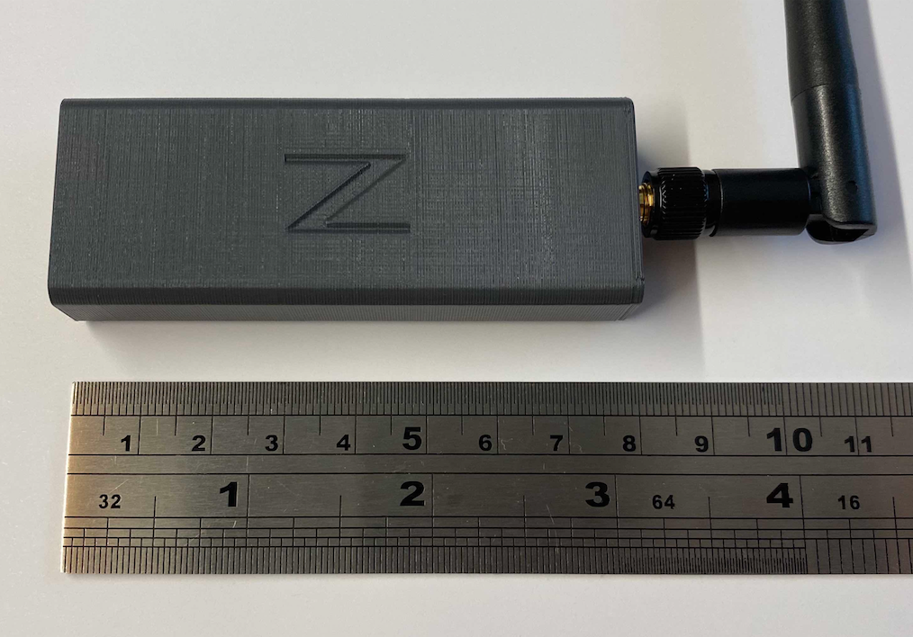

# Zigbee2Tasmota PCB

This project contains Gerber files for a PCB designed for a Hub running [Zigbee2Tasmota](https://tasmota.github.io/docs/#/Zigbee).

If needed or wanted (e.g. for flashing an update) it is possible to flash the CC2530 in two ways:
* using a CCDebugger, there is an interface on pcb for that.
* using the Nodemcu itself to flash the CC2530. You can find how to do this in the link above.

## Photos

## Ready-Made Hub

I'm offering ready-made kits which include:

* pre-soldered Boards (PCB, NodeMCU, CC2530 and Antenna)
* pre-flashed with the latest firmware version
* 3D-printed case (available in different colors)

**To order one for yourself**, please get in touch with me at h4nc.zigbee(a)gmail.com or drop me a PM on the [HomeAssistant community forum](https://community.home-assistant.io/t/buy-a-ready2use-zigbee2mqtt-stick-flashed-antenna-mod-and-printed-case/111743?u=h4nc).

## License

See [LICENSE.md](./LICENSE.md).
